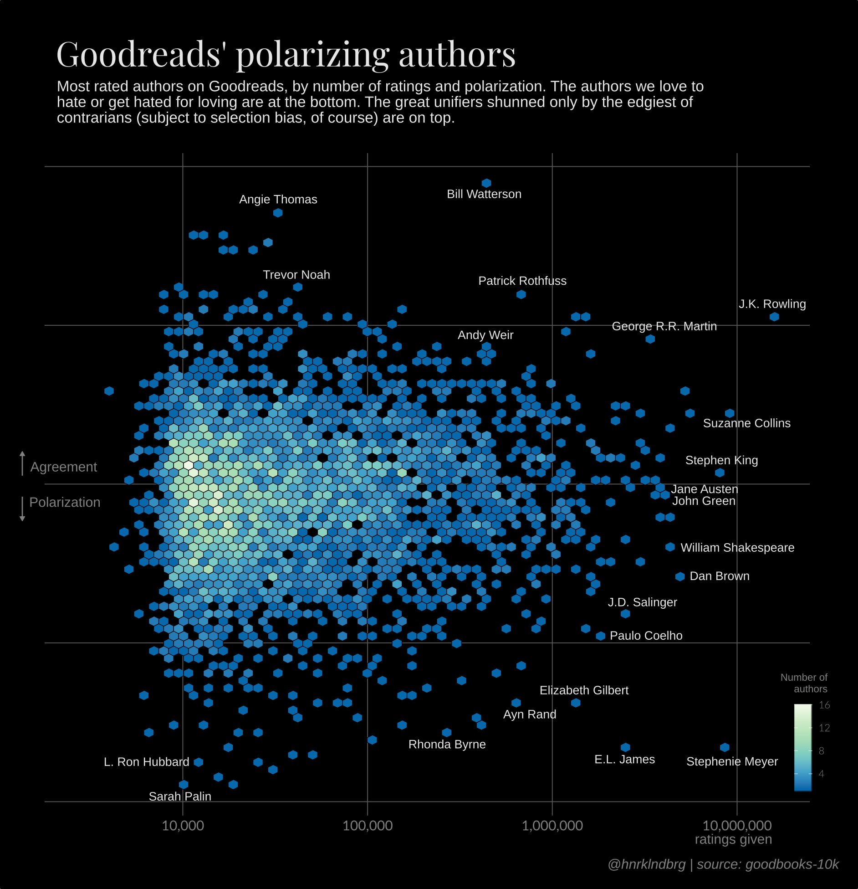

I stumbled on a good sized data set about books: the [Goodbooks 10k](https://github.com/zygmuntz/goodbooks-10k), containing the top 10,000 most rated books on Goodreads (presumably -- there seems to be a don't-mention-the-war policy on stating the source as Goodreads explicitly, despite the data being available in credible places). It's a good data set to fiddle with if you're into recommendation systems.

Here I'll only scratch a bit of exploratory and descriptive surface. The analysis is straightforward, and the final chart is another attempt to visualize many data points while wanting to identify at least some individual points, particularly outliers. I tend to stay away from interactive vizes, from laziness, or a lack of chops, or from some rationalized elegance in static, printable stuff. Looking at the end result this one probably would benefit from some hover-interactions and a search field, but hey...

Anyways, I did use interactive charts during the exploratory phase, with the convenient `plotly::ggplotly` function. These interactives are found below. The end result:

{width=600px}


```{r, results='hide', message=FALSE, warning=FALSE, error=FALSE}
library(tidyverse)
source('henrik.r') # For the amazingly named theme used later
```

Get the data.

```{r}
df.books <- read_csv('https://github.com/zygmuntz/goodbooks-10k/raw/master/books.csv') %>%
  mutate(first_author = map_chr(str_split(authors, ','), 1),
         trim_title = strtrim(title, 70))
```

This data contains the 10.000 most rated books on Goodreads. It seems reasonable that these books are higher rated than those who didn't make the list. Below is the distribution of books' ratings, checking in at about 4 out of 5 average rating.


```{r}
df.books %>%
  ggplot(aes(average_rating)) +
    geom_histogram(binwidth=0.1)
```


As I wanted to do a not totally-obvious take on this data, I pulled up an article from [FiveThirtyEight](https://fivethirtyeight.com/features/al-gores-new-movie-exposes-the-big-flaw-in-online-movie-ratings/) that analyzed the distribution of IMDB scores. In particular, I got interested in the polarization metric from [Esteban and Ray (1994)](https://www.econ.nyu.edu/user/debraj/Courses/Readings/Esteban%20Ray94.pdf). This measures how different readers' ratings are. A low score means that most users rate the book about the same, while a high score means that many users rated the book high and many other users rated the book low.


```{r}
polarization <- function(rating, p) {
  sum <- 0
  for (i in seq_along(rating)) {
    for (j in seq_along(rating)) {
      sum <- sum + p[i] * p[j] * abs(rating[i] - rating[j])
    }
  }
  sum
}


df.polarization <- df.books %>%
  filter(coalesce(language_code, 'eng') %>%
           str_detect('^en')) %>%
  gather(rating, n, matches('^ratings_[1-5]')) %>%
  mutate(rating = gsub('ratings_', '', rating) %>%
           as.integer()) %>%
  group_by(book_id) %>%
  mutate(p = n / sum(n)) %>%
  summarize(polarization = polarization(rating, p))

df.books <- df.books %>%
  inner_join(df.polarization, by='book_id')


df.books %>%
  arrange(desc(polarization)) %>%
  head(100) %>%
  select(first_author, trim_title, polarization, average_rating)

```


Let's see what the polarization score finds. Ordering the list by descending polarization, we find Fifty Shades and Twilight on top. There is quite some range in average rating; even for the top-10 polarizing scores, the rating is between 3.13 and 3.67. In other words, polarization seems to measure something at least somewhat different than averate rating.

Let's plot the average rating to the polarization score and see what it looks like.


```{r}
p <- df.books %>%
  ggplot(aes(polarization, average_rating, text = paste0(first_author, ': ', trim_title))) +
    geom_point()

plotly::ggplotly(p, tooltip = 'text')
```

A weird-ish shape which makes sense when you think about it: a high average rating nescessarily means having only few that rate the book low.

I decided two things when exploring this chart:

 * I would like the points to be a bit more pulled apart. The concentration on the left-hand side makes it hard to separate and annotate indivdual works.
 * Some authors have several books in this data set. In particular, Bill Watteron's Calvin and Hobbes have FIVE books in the top-10 least polarizing books. I decided to aggregate ratings and polarization scores by authors instead.


```{r}
p <- df.books %>%
  group_by(first_author)  %>%
  summarize(polarization = weighted.mean(polarization, ratings_count),
            ratings = sum(ratings_count),
            books = paste0(' * ', trim_title, collapse='\n')) %>%
  ggplot(aes(ratings, -polarization, text = paste0(first_author, '\n\n', books))) +
    geom_point() +
    scale_x_log10()

plotly::ggplotly(p, tooltip = 'text')
```

There. Much better spread, and the axes still make sense: the (log) total number of ratings on X and polarization on Y, with the most unifying / least polarizing books on top.

I decided to do a hexbin plot instead of individual points. My main goal became to show the outlier authors along the outer edges of the cluster. For the bulk of the points in a static chart, a hexbin seemed to make more much sense than overlapping points. I manually picked some twenty authors to highlight -- a combination of space around the points and personal taste. After bringing and old `theme_henrik` in, i exported to SVG and tweaked the final pieces in Inkscape.


```{r}
highlights <- c("Bill Watterson", "Patrick Rothfuss", "George R.R. Martin", "J.R.R. Tolkien", "J.K. Rowling", "Suzanne Collins", "Stephen King", "Dan Brown", "J.D. Salinger", "Paulo Coelho", "Stephenie Meyer", "E.L. James", "Elizabeth Gilbert", "Ayn Rand", "Herman Melville", "Rhonda Byrne", "Adolf Hitler", "L. Ron Hubbard", "Sarah Palin", "Angie Thomas", "Trevor Noah", "Andy Weir", "William Shakespeare", "John Green", "Jane Austen")

df.books %>%
  group_by(first_author)  %>%
  summarize(polarization = weighted.mean(polarization, ratings_count),
            average_rating = weighted.mean(average_rating, ratings_count),
            ratings = sum(ratings_count)) %>%
  ggplot(aes(ratings, -polarization)) +
    #geom_point(shape = 21, fill = 'black', color='white', size=3) +
    geom_hex(bins = 70, color = 'black', size=0.2) +
    geom_text(aes(label = ifelse(first_author %in% highlights, first_author, NA)), color='#e6e6e6', size=3, hjust = 1) +
    scale_x_log10(labels = scales::comma) +
    scale_fill_distiller(palette = 'GnBu') +
    labs(x="", y="") +
    theme_henrik(grid='XY') +
    theme(text = element_text(color = '#e6e6e6'),
          axis.text = element_text(color = '#e6e6e6'),
          plot.background = element_rect(fill = 'black'),
          panel.grid.major.x = element_line(color='#555555', size=0.3),
          panel.grid.major.y = element_line(color='#555555', size=0.3))
```


```{r, eval=FALSE, echo=FALSE}
ggsave('out.svg', width=9, height=7)
```

I happily invite you, dear reader, to use this for makeovers. I still haven't figure out a way to do the many-points-where-some-are-interesting in a satisfactory way. It might simply be a problem that needs the extra dimension of interactivity. As is though, the chart tells a story perhaps not of the authors, but of the Goodreads readership -- which I found quite amusing.

To lower the threshold for you to give this a try yourself, I've put  the aggregated author, polarization score, average rating and number of ratings here: [author-agg.tsv](author-agg.tsv). If you just want to look up your favorite author, I also put a copy on [Google Drive](https://docs.google.com/spreadsheets/d/1uc01cr3LvM2wJCN03RwTYdhaP9LgWg3t0LEZp9BXHmc/edit?usp=sharing) for you.

```{r}
df.books %>%
  group_by(first_author) %>%
  summarize(polarization = weighted.mean(polarization, ratings_count),
            average_rating = weighted.mean(average_rating, ratings_count),
            ratings = sum(ratings_count)) %>%
  write_tsv('author-agg.tsv')
```


