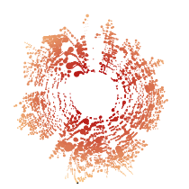

I've spent a good part of the holidays admiring [Nicholas Rougeux' beautiful data art](https://www.c82.net/work/?cat=5). In particular, I was intrigued by his [Off the Staff](https://www.c82.net/offthestaff/) visualizations of classical music. Here, I'll replicate his visualization on a favorite piece of mine that was missing from his set: [the Funeral March from Gustav Mahler's fifth symphony](https://www.youtube.com/embed/tPpm323M_Ik).

<iframe width="560" height="315" src="https://www.youtube.com/embed/tPpm323M_Ik?rel=0" frameborder="0" gesture="media" allow="encrypted-media" allowfullscreen></iframe>


Nicholas' original versions use digitized musical scores to read the notes played. Each note is plotted as a point sized according to the length of the note. Notes are plotted in a circle with time progressing clockwise and higher notes being further out from the center.

## Getting the data

My Google-fu quickly failed me: I could only find PDF files for scores. My second idea turned out to be sufficient: MIDI files. I quickly learned that the marvellous site [Kunst der Fuge](http://www.kunstderfuge.com/) has many thousands of MIDI files for classical music, including [the one I'm looking for](http://www.kunstderfuge.com/mahler.htm). 


```{r, message=FALSE}
library(tidyverse)
if (!file.exists('mahler.mid'))
  download.file('http://www.kunstderfuge.com/-/midi.asp?file=28/mahler_symphony_5_1_(c)boot.mid', 'mahler.mid')
```

MIDI files contain each note to be played for a song and should contain all information I need for data. I found a tool called [midicsv](https://www.fourmilab.ch/webtools/midicsv/) to extract the MIDI information to CSV via the command line. It's a bit of a hassle to jump in and out of R to do this though, so I Googled for R packages reading MIDI files. Sure enough: the `tuneR` package has what I was looking for. Read a MIDI file, get a nice data frame in return. The package even gives individual `track`s with names, meaning that I can figure out which instrument plays each note.

```{r, message=FALSE, cache=TRUE}
library(tuneR)
df.song <- readMidi('mahler.mid')

df.tracks <- df.song %>%
  filter(event == 'Sequence/Track Name') %>%
  transmute(track, track_name = parameterMetaSystem)

df.notes <- getMidiNotes(df.song) %>%
  inner_join(df.tracks, by='track') 

df.notes %>%
  arrange(time) %>%
  head(50)
```

_(I'm sure that MIDI files in general are not accurate representations of original scores. Sometimes though, perfect is the enemy of good and done is better than perfect.)_

I'm interested in `note` which tells me the note being played (60 being middle C, 61 being middle C# and so on), `time` for the timestamp where each note starts, and `length` to tell the duration of the note. To make sure I had useful data, I plotted the first minute or so with time on the X axis and notes on the Y.


```{r, echo=TRUE}
df.notes %>%
  filter(time < 300000) %>%
  ggplot(aes(time, note + track/max(track), xend=time + length, yend = note + track/max(track))) +
    geom_segment(size=1) +
    theme_void()
```

## Going circular

This already blew my mind, and I spent a good while following the notes alongside listening to the piece. There are some outlier looking `d'''` on the track "perc" which I assume are some percussion instrument. I don't know enough music theory to tell whether these are MIDI artifacts or should be considered reasonable notes to plot. From a pure visual point-of-view, I decided to remove these.

```{r}
df.notes <- df.notes %>%
  filter(track_name != 'perc' | note != 98)
```


Anyways; let's get to replicating Nicholas' plot using `ggplot2`. I want the piece to start at 12 o'clock and progress clockwise. Abusing the trigonometry a bit gets it right, and a first version indeed came alive.


```{r, echo=TRUE}
df.notes %>%
  mutate(angle = 2 * pi * time / max(time + 1),
         radius = 25 + 75 * (note - min(note)) / (max(note) - min(note)),
         size = 5 * sqrt(length / max(length))) %>%
  ggplot(aes(radius * sin(angle), radius * cos(angle), size=size)) +
    geom_point(color="#882222", alpha=0.7) +
    theme_void() +
    scale_size_identity() +
    coord_equal()
```

The structure is definitely there! I wasn't happy with the colors though. First, using transparency to show overlapping notes washes out all colors and is kind of dull. Second, the original had some beautiful variations in lightness/darkness. I realized that this was a perfect place to try out [Nadieh Brehmer's tutorial on SVG blend modes](https://www.visualcinnamon.com/2016/05/beautiful-color-blending-svg-d3.html).

To have a SVG on which to set blend modes, I could save the plot using `svglite` and edit elsewhere. Since I want to automate the whole thing I instead decided to build the SVG.

Hand crafted data visualizations using SVG sounds a lot like D3.js. However, I'm only doing static visualizations so there's no point in getting another software stack going. SVGs are a text only format easy enough to generate straight from R. After fighting a little with making `stringr::str_interp` play nicely in a vectorized pipe, I ended up using `glue::glue` function to use string interpolation for readable code.

```{r message=FALSE, warning=FALSE, results='hide'}
library(glue)

df.notes %>%
  mutate(angle = -0.5 * pi + 2 * pi * time / max(time + 1),
         radius = 25 + 75 * (note - min(note)) / (max(note) - min(note)),
         size = round(4 * sqrt(length / max(length)), 1),
         color = colorRampPalette(c('#B31010', '#FDCC8A'))(max(note) - min(note))[note - min(note) + 1],
         x = round(radius * cos(angle), 1),
         y = round(radius * sin(angle), 1)) %>%
  with(paste0(
    '<svg xmlns="http://www.w3.org/2000/svg" viewBox="-105 -105 210 210">',
      '<g>',
      paste0(glue('<circle cx="{x}" cy="{y}" r="{size}" fill="{color}" style="mix-blend-mode: multiply;" />'), collapse='\n'),
      '</g>',
    '</svg>')) %>%
  cat(file='out.svg')
```


The SVG is very basic. A viewBox defines the plot with `0,0` in the middle and `100` radius with some margin. The trigonometry changes a little form SVG's coordinates being laid out differently. Round the coordinates to save a little file size, and throw in a little gradient. The end result turned out amazing! 

<div>
</img>
</div>

To finish it all, polish in Illustrator or Inkscape. Or color by instruments. Or generate a bunch of these and set them as small multiples. Or... well, try it out yourself. 

Again, all creative kudos for this goes straight to [Nicholas Rougeux](https://twitter.com/rougeux). Make sure to check out [all of his other awesome stuff too](https://www.c82.net/).
